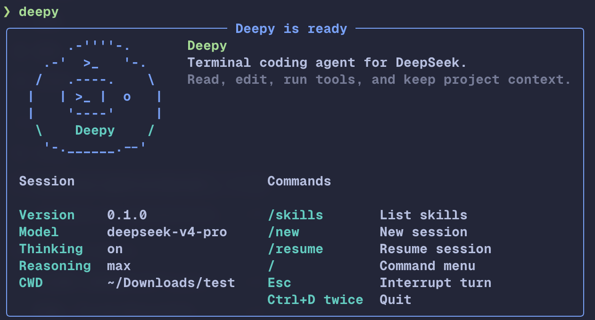
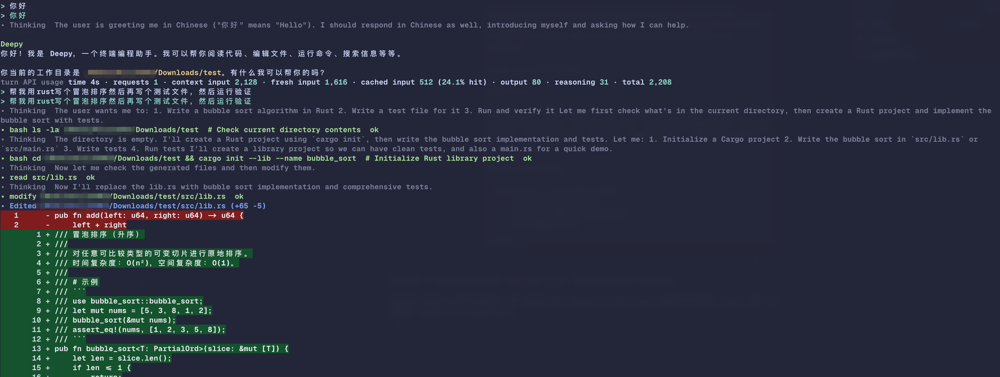
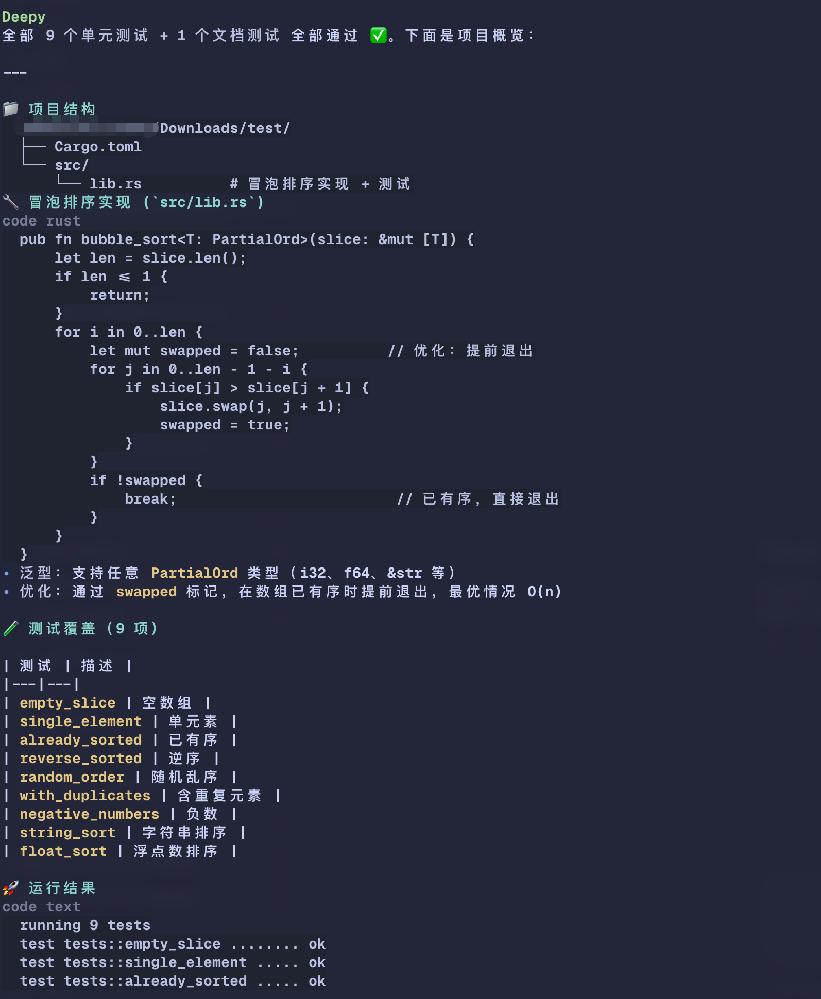
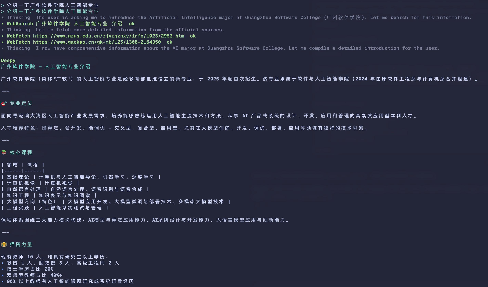

<p align="center">
  
</p>

<h1 align="center">Deepy</h1>

<p align="center">
  A cute terminal coding agent for DeepSeek models.
  <br>
  Read, edit, run tools, search the web, and keep project context in one terminal session.
</p>

<p align="center">
  <a href="https://kirineko.github.io/deepy/">Website</a>
  ·
  <a href="README.zh-CN.md">中文文档</a>
  ·
  <a href="#quick-start">Quick Start</a>
</p>



## What Is Deepy?

Deepy is a Python terminal coding agent built for DeepSeek's OpenAI-compatible
models. It keeps the workflow inside your terminal: ask questions, inspect a
project, edit files, run commands, search or fetch web content, and resume the
same project session later.

Deepy is designed around DeepSeek V4 thinking mode, long context, cache-friendly
prompting, and a Rich terminal interface that makes tool calls, diffs, usage, and
context state visible while the agent works.

## Highlights

- DeepSeek-first model setup with `deepseek-v4-pro`, thinking enabled, and
  `reasoning_effort=max` by default.
- OpenAI Agents SDK integration through `OpenAIChatCompletionsModel`.
- Project-aware coding tools for reading files, modifying files, running shell
  commands, and showing readable diffs.
- Web research tools for search and direct URL fetching when a task needs fresh
  information.
- Session history, `/resume`, `/new`, automatic context tracking, and compacting
  for long project work.
- TOML-only private configuration at `~/.deepy/config.toml`.
- Terminal UI with Markdown rendering, DeepSeek thinking display, per-turn usage,
  context window status, and version update checks.

## See It Work

### Start In A Project

Deepy shows the current model, thinking settings, working directory, and the core
commands directly on startup.


### Build And Verify Code

Ask Deepy to implement a change, write tests, run the project test command, and
summarize the result.



Deepy can also turn command output into a readable project summary, including
files created, code snippets, and test coverage.



### Research With Sources

Deepy includes WebSearch and WebFetch tools, so a terminal session can gather
current information and fetch exact pages when a URL is provided.



## Quick Start

Install from PyPI after the first release:

```bash
uv tool install deepy
```

Install the latest code from GitHub:

```bash
uv tool install git+https://github.com/kirineko/deepy.git
```

Configure your DeepSeek API key:

```bash
deepy config setup
```

Start Deepy in a project:

```bash
cd your-project
deepy
```

## Configuration

Deepy only uses TOML configuration. JSON config files are intentionally rejected.

```toml
# ~/.deepy/config.toml
api_key = "sk-..."
model = "deepseek-v4-pro"
base_url = "https://api.deepseek.com"
context_window_tokens = 1048576
compact_threshold = 0.8
```

You can also initialize config non-interactively:

```bash
deepy config init --api-key sk-... --model deepseek-v4-pro
```

## Common Commands

```bash
deepy --version
deepy config setup
deepy doctor
deepy doctor --live --json
deepy status
deepy skills list
deepy sessions list
deepy sessions show <session-id>
deepy run "summarize this project"
```

Inside the interactive terminal:

```text
/skills   List available skills
/new      Start a fresh conversation
/resume   Pick a previous session
/         Open the command menu
Esc       Interrupt the current model turn
Ctrl+D    Press twice to quit
```

## Project Rules And Skills

Deepy automatically loads project instructions from:

- `AGENTS.md`
- `.deepy/skills/*/SKILL.md`

This lets each repository define local conventions, commands, review rules, and
domain-specific skills without changing global config.

## Development

```bash
uv sync --group dev
uv run pytest
uv run ruff check
uv run pyright
uv build
```

The Python package is built from `src/deepy`. GitHub Pages files and screenshot
assets live outside the package directory and are not included in the wheel.

## Release Status

Deepy is preparing its first public `0.1.0` release. The current release path is
GitHub + PyPI. Standalone binaries and npm wrappers can be added later, but the
primary distribution is the Python CLI.
