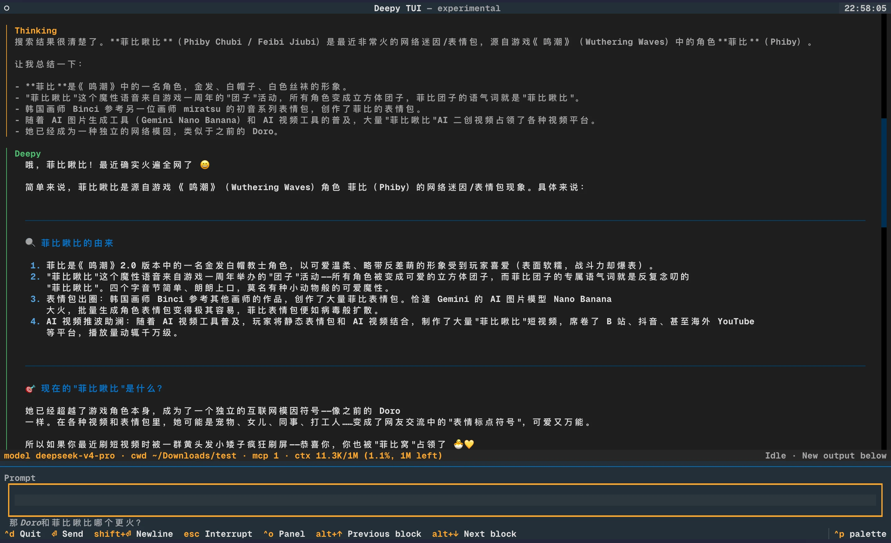

<p align="center">
  
</p>

<h1 align="center">Deepy</h1>

<p align="center">
  A terminal-native coding agent for real project work.
</p>

<p align="center">
  <a href="https://deepy.kirineko.tech/"><strong>Install Website</strong></a>
  ·
  <a href="https://kirineko.github.io/deepy/">GitHub Pages</a>
  ·
  <a href="README.zh-CN.md">中文文档</a>
</p>


## What Deepy Is

Deepy is a Python CLI coding agent for real project work. It stays in your
terminal and combines OpenAI Agents SDK tool orchestration, project Rules,
Agent Skills, MCP, subagents, sessions, and visible UI to read code, edit files,
run commands, search the web, and resume long tasks. It is DeepSeek-first while
also supporting OpenAI-compatible providers.

## Why Use It

- **DeepSeek-first agent loop**: tuned for DeepSeek V4 thinking mode while still
  supporting OpenAI-compatible providers such as OpenRouter and Xiaomi MiMo.
- **Transparent terminal execution**: thinking, tool calls, diffs, shell output,
  usage, and context pressure stay visible in the transcript.
- **Project memory and continuity**: `AGENTS.md` rules, JSONL sessions,
  `/resume`, `/compact`, automatic compacting, and context-window status keep
  long project work recoverable.
- **Extensible agent ecosystem**: Agent Skills, MCP servers, subagents, and
  skill-market installation give Deepy reusable workflows beyond built-in tools.
- **Practical coding controls**: stale-write protection, direct `!cmd` local
  commands, managed background tasks, and `/ps` / `/stop` keep local execution
  reviewable.
- **Cross-platform shell support**: POSIX shell, PowerShell, cmd, Windows paths,
  UTF-8 output, CRLF editing, and non-interactive Windows local command mode.

## Quick Start

1. Install `uv`:

```bash
# macOS / Linux
curl -LsSf https://astral.sh/uv/install.sh | sh

# Windows PowerShell
powershell -ExecutionPolicy ByPass -c "irm https://astral.sh/uv/install.ps1 | iex"
```

2. Install Deepy:

```bash
uv tool install deepy-cli
```

3. Start Deepy in a project:

```bash
cd your-project
deepy
```

If Deepy has not been configured yet, the first run guides you through provider,
API key, model, and theme setup. You can later run `deepy config setup` to
reconfigure manually.

Upgrade or uninstall:

```bash
uv tool upgrade deepy-cli
uv tool uninstall deepy-cli
```

## First Session

Try requests like these inside `deepy`:

```text
Summarize this project and point out the main entry points.
Read @src/app.py and explain how the request flow works.
Fix the failing test, run the focused test, and summarize the diff.
Search the web for the current API behavior, then update the integration notes.
```

Useful interactive inputs:

```text
@src/app.py       Mention a file in the current project
!pytest -q        Run a local non-interactive command directly
/model            Select provider, model, and thinking mode
/status           Show usage, context pressure, and DeepSeek balance
/resume           Resume a previous project session
/new              Start a fresh session
/compact          Compact the active session context
/mcp              Show MCP server status and tools
/skills           Manage local and market Skills
/ps               Show managed background shell tasks
/stop             Choose background shell tasks to stop
Esc               Interrupt the current model turn
Ctrl+D            Press twice to quit
```

## What It Looks Like

### Terminal-Centered Agent Loop

Deepy keeps model reasoning, WebFetch, shell output, and status lines visible in
one transcript.


### Code Editing With Reviewable Diff

File edits are shown with path information and readable diff output.


### Search, Fetch, And Local Commands

Use WebSearch / WebFetch for external context, `@` for file mentions, and `!`
for direct local commands.


## Stable UI And Experimental TUI

The default `deepy` command starts the stable Rich/prompt-toolkit terminal UI.
The opt-in Textual interface is available with:

```bash
deepy tui
```

The TUI has a scrollable transcript, live thinking blocks, richer tool output
blocks, slash-command and `@file` suggestions, status/help screens, and a
Deepy-owned diff view. It remains experimental and may change between releases.



`/status` shows session/project usage, context-window pressure, and DeepSeek
balance in one panel. Exiting the TUI prints the same compact session summary
as the stable terminal UI.

See [docs/deepy-ui-and-tui.md](docs/deepy-ui-and-tui.md) for the full feature
comparison and current limitations.

## Rules

Rules are project and personal instructions that shape how Deepy should work.
Deepy automatically loads them from `AGENTS.md` files:

- `~/.deepy/AGENTS.md` for Deepy-wide personal guidance
- `AGENTS.md` files from the git root down to the current working directory

Project `AGENTS.md` files are loaded from broad to specific. A file in a nested
directory appears after the repository root file and takes precedence when rules
conflict. Direct user instructions still take precedence over loaded
`AGENTS.md` guidance.

Run `/init` in the interactive terminal to have Deepy inspect the repository and
create or refresh the project root `AGENTS.md`.

## Skills

Skills are reusable capability packs. Deepy discovers three kinds:

- **Project skills**: `<project>/.agents/skills/<name>/SKILL.md`. These are
  shared with the current repository and take priority over user or built-in
  skills with the same name.
- **User skills**: `~/.agents/skills/<name>/SKILL.md`. These are personal
  skills available across projects and override built-in skills with the same
  name.
- **Built-in skills**: packaged with Deepy for common workflows. They are always
  available, but they are not editable or uninstallable through the skill UI.

Skills use the standard Agent Skills progressive-disclosure flow: Deepy shows
Skill metadata first, and the model reads the full `SKILL.md` only when the task
matches that skill.

The skill market is a curated source for installable Skills. Market-installed
Skills can be installed into user or project scope, updated, and uninstalled
through Deepy's Skills UI. Deepy records market-installed Skill metadata under
`~/.deepy/skill-market/`.

Use `/skills` to manage local and market Skills, or invoke a Skill directly:

```text
/skills
/<name> [request]
```


## MCP

Deepy can load MCP servers through the OpenAI Agents SDK. MCP is how you connect
external tools such as search providers, databases, local services, or
organization-specific context providers.

Most users only need `~/.deepy/mcp.json`. Project-level MCP configuration is
ignored by default because stdio MCP servers can start local commands. Enable it
only for repositories you trust.

See [docs/mcp.md](docs/mcp.md) for setup, fields, search preference, subagent
MCP inheritance, and troubleshooting.

## Trust Boundaries

- File edits are rendered with path information and readable diffs.
- Existing file replacement uses stale-write protection.
- `!cmd` is direct local command mode; model-started shell commands are shown in
  the transcript.
- MCP stdio servers start local commands. Project MCP config is ignored by
  default and should only be enabled for repositories you trust.
- Built-in subagents do not receive source mutation tools by default.
- The tester subagent uses constrained `test_shell`, not raw unrestricted
  `shell`.

## Learning Resources

| Topic | English | Chinese |
| --- | --- | --- |
| Tutorial videos | [docs/tutorial-videos.md](docs/tutorial-videos.md) | [docs/tutorial-videos.zh-CN.md](docs/tutorial-videos.zh-CN.md) |
| MCP setup and troubleshooting | [docs/mcp.md](docs/mcp.md) | [docs/mcp.zh-CN.md](docs/mcp.zh-CN.md) |
| Subagents and custom subagents | [docs/subagents.md](docs/subagents.md) | [docs/subagents.zh-CN.md](docs/subagents.zh-CN.md) |
| Stable UI versus experimental TUI | [docs/deepy-ui-and-tui.md](docs/deepy-ui-and-tui.md) | [docs/deepy-ui-and-tui.zh-CN.md](docs/deepy-ui-and-tui.zh-CN.md) |

## Command Reference

```bash
deepy --version
deepy config setup
deepy config reset
deepy config theme
deepy doctor
deepy doctor --live --json
deepy status
deepy tui
deepy skills list
deepy skills show <name>
deepy sessions list
deepy sessions show <session-id>
deepy run "summarize this project"
```

Inside the interactive terminal:

```text
/help                   Show interactive help
/model                  Select provider, model, and thinking mode
/status                 Show usage, context pressure, and DeepSeek balance
/resume                 Resume a previous project session
/new                    Start a fresh session
/compact                Compact the active session context
/mcp                    Show MCP server status and tools
/skills                 Manage local and market Skills
/<name> [request]       Invoke a Skill directly
/init                   Create or update project AGENTS.md
/theme                  Show or change terminal UI theme
/ps                     Show managed background shell tasks
/stop                   Choose background shell tasks to stop
```

## Configuration

Deepy stores configuration in `~/.deepy/config.toml`. The interactive first-run
setup creates this file for most users.

Minimal resolved shape:

```toml
[model]
api_key = "sk-..."
provider = "deepseek"
name = "deepseek-v4-pro"
base_url = "https://api.deepseek.com"
thinking = true
reasoning_effort = "max"

[context]
window_tokens = 1048576
compact_trigger_ratio = 0.8
reserved_context_tokens = 50000
compact_preserve_recent_messages = 2

[ui]
theme = "dark" # dark or light
```

Manual configuration commands:

```bash
deepy config setup
deepy config init --api-key sk-... --provider deepseek --model deepseek-v4-pro
deepy config init --api-key sk-or-... --provider openrouter --model xiaomi/mimo-v2.5-pro
deepy config init --api-key sk-or-... --provider openrouter --model anthropic/claude-sonnet-4.5 --thinking minimal
deepy config init --api-key sk-... --provider xiaomi --model mimo-v2.5-pro
deepy config theme light
```

Supported provider/model pairs:

- `deepseek`: `deepseek-v4-pro`, `deepseek-v4-flash`; thinking modes `none`,
  `high`, `max`.
- `openrouter`: UI model selection offers `xiaomi/mimo-v2.5-pro`,
  `xiaomi/mimo-v2.5`; setup/init may also use a model id copied from
  OpenRouter. Thinking modes are `enabled`, `disabled`, `xhigh`, `high`,
  `medium`, `low`, `minimal`, `none`.
- `xiaomi`: `mimo-v2.5-pro`, `mimo-v2.5`; thinking modes `enabled`,
  `disabled`.

WebSearch uses Deepy's hosted SearXNG endpoint by default. You can override it:

```toml
[tools.web_search]
searxng_url = "https://your-searxng.example/"
```

## Development

```bash
uv sync --group dev
uv run pytest
uv run ruff check
uv run ty check src
uv build
```

The Python package is built from `src/deepy`. GitHub Pages files and screenshot
assets live outside the package directory and are not included in the wheel.
