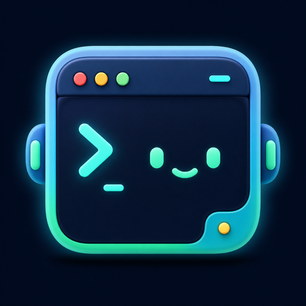
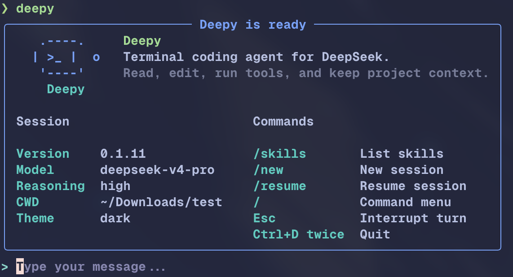
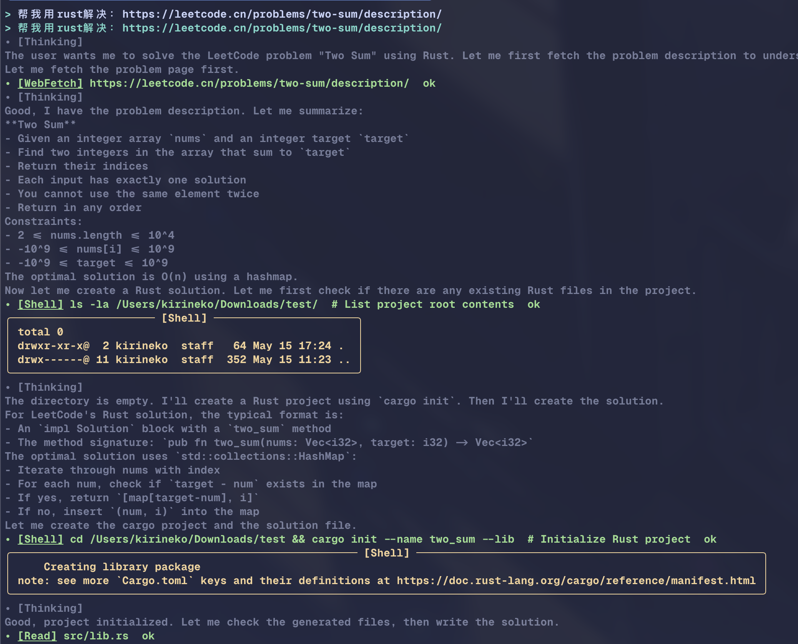
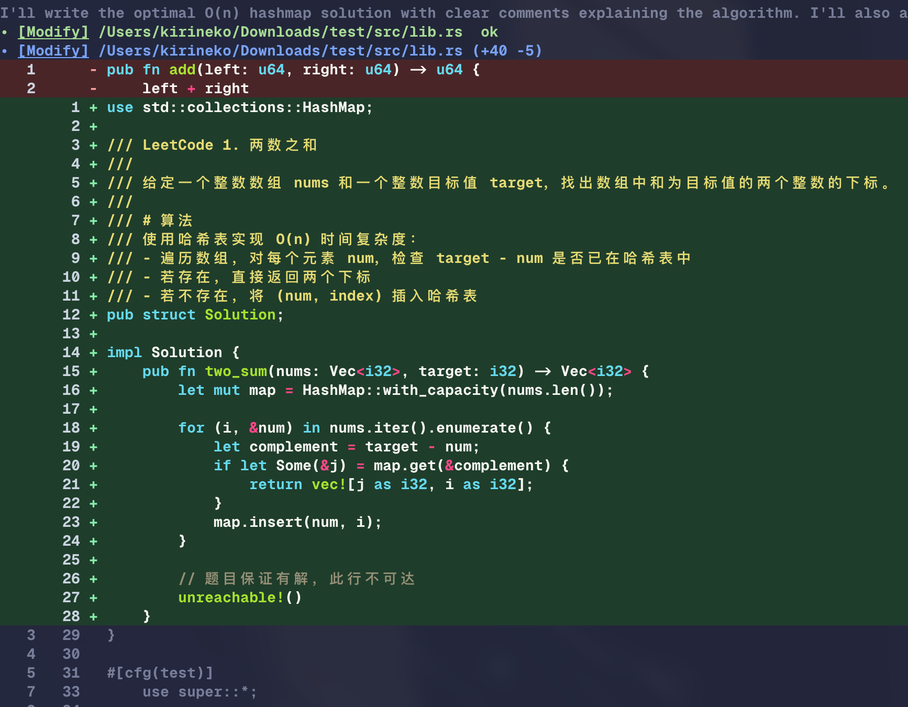
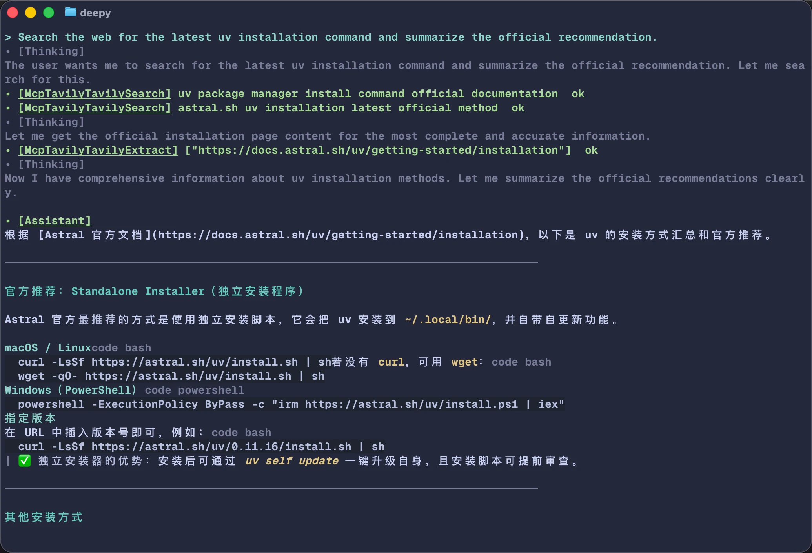
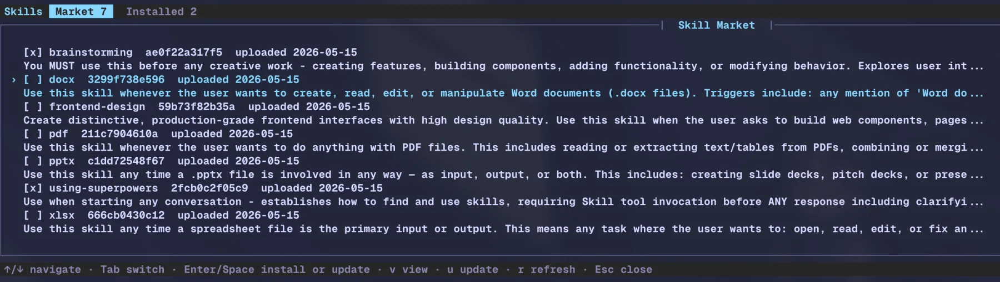

<p align="center">
  
</p>

<h1 align="center">Deepy</h1>

<p align="center">
  面向真实项目工作的终端原生编程 Agent。
</p>

<p align="center">
  <a href="https://deepy.kirineko.tech/"><strong>安装</strong></a>
  ·
  <a href="https://kirineko.github.io/deepy/">主页</a>
  ·
  <a href="README.md">English</a>
</p>



## Deepy 是什么

Deepy 是面向真实项目工作的 Python CLI 编程 Agent。它在终端里整合 OpenAI Agents SDK
工具编排、项目 Rules、Agent Skills、MCP、subagents、sessions 和可审查 UI，用来理解代码、
修改文件、运行命令、检索网页，并恢复长任务。Deepy 以 DeepSeek 为优先，同时支持
OpenAI 兼容 provider。

## 为什么使用 Deepy

- **DeepSeek-first agent loop**：针对 DeepSeek V4 thinking 模式优化，同时支持
  OpenRouter、小米 MiMo 等 OpenAI 兼容 provider。
- **透明的终端执行过程**：thinking、工具调用、文件 diff、shell 输出、usage
  和上下文压力都显示在 transcript 中。
- **项目记忆与连续性**：`AGENTS.md` Rules、JSONL sessions、`/resume`、`/compact`、
  自动 compact 和上下文窗口状态，让长任务可以恢复和延续。
- **可扩展 Agent 生态**：Agent Skills、MCP servers、subagents 和 skill 市场，
  让 Deepy 可以复用超出内置工具的工作流。
- **实用的编程控制面**：stale-write protection、直接 `!cmd` 本地命令、
  后台任务管理和 `/ps` / `/stop` 让本地执行更可审查。
- **跨平台 shell 支持**：支持 POSIX shell、PowerShell、cmd、Windows 路径、
  UTF-8 输出、CRLF 编辑和 Windows 非交互本地命令路径。

## 快速开始

1. 安装 `uv`：

```bash
# macOS / Linux
curl -LsSf https://astral.sh/uv/install.sh | sh

# Windows PowerShell
powershell -ExecutionPolicy ByPass -c "irm https://astral.sh/uv/install.ps1 | iex"
```

2. 安装 Deepy：

```bash
uv tool install deepy-cli
```

3. 进入项目并启动：

```bash
cd your-project
deepy
```

如果 Deepy 还没有配置过，首次启动会自动引导你填写 provider、API key、模型和主题。
之后可以随时运行 `deepy config setup` 手动重新配置。

升级或卸载：

```bash
uv tool upgrade deepy-cli
uv tool uninstall deepy-cli
```

## 第一轮会话

进入 `deepy` 后可以尝试：

```text
总结这个项目，并指出主要入口文件。
阅读 @src/app.py，解释请求流程。
修复失败测试，运行聚焦测试，并总结改动。
搜索当前 API 行为，然后更新集成说明。
```

常用交互输入：

```text
@src/app.py       引用当前项目文件
!pytest -q        直接运行本地非交互命令
/model            选择 provider、模型和 thinking 模式
/status           查看用量、上下文压力和 DeepSeek 余额
/resume           恢复历史项目会话
/new              开始新会话
/compact          压缩当前会话上下文
/mcp              查看 MCP server 状态和工具
/skills           管理本地和市场 Skills
/ps               查看后台 shell 任务
/stop             选择后台 shell 任务停止
Esc               中断当前模型回合
Ctrl+D            连按两次退出
```

## 效果预览

### 终端里的 Agent 工作流

Deepy 会把模型 reasoning、WebFetch、shell 输出和状态行放在同一条 transcript 中。



### 带 diff 的代码修改

文件修改会展示路径信息和可读 diff，便于用户继续前审查 Agent 改了什么。



### 搜索、抓取和本地命令

用 WebSearch / WebFetch 获取外部上下文，用 `@` 精确引用项目文件，用 `!` 直接执行本地命令。



## Classic UI 与 Modern UI

Deepy 有两个对等的终端界面。Classic UI 是 Rich/prompt-toolkit 终端 UI，
Modern UI 是 Textual 终端 UI。默认 `deepy` 命令会按 `ui.interface`
配置进入对应 UI；缺配置时默认使用 Classic UI + dark theme。下面的兼容命令仍可直接启动
Modern UI：

```bash
deepy tui
```

Modern UI 提供紧凑的可滚动 transcript、轻量状态行、原生 Textual composer、实时 assistant/tool
活动状态、紧凑工具摘要行、slash command 和 `@file` 提示、内联 audit/model/theme 选择、
状态/帮助界面，以及 Deepy 自有的 diff view。可以在任一 UI 中用 `/ui` 设置下次 `deepy`
启动时默认进入的 UI。

`/status` 会在一个面板中汇总 session/project usage、context window 和 DeepSeek 余额。
退出 Modern UI 时会输出和 Classic UI 一致的 compact session summary。prompt 文本、图片附件、生成式输入建议、
slash suggestions 和文件 suggestions 是彼此独立的 composer 状态，因此 UI 专用的附件 label
不会写入可编辑 prompt buffer。图片附件会显示在附件行中，并可直接在输入框焦点下用
下箭头进入附件选择、左右箭头选择、Backspace 删除、上箭头回到普通输入，不会修改 prompt 文本。共享的 `dark` / `light`
设置在 Modern UI 中会映射到精选 Textual 主题，其中 `dark` 默认使用 `tokyo-night`；Modern UI 也可以通过
`/theme` 保存 Textual-only 的 `ui.textual_theme` 覆盖。

完整功能对比和当前限制见 [docs/deepy-ui-and-tui.zh-CN.md](docs/deepy-ui-and-tui.zh-CN.md)。

## Rules

Rules 是影响 Deepy 工作方式的项目级和个人级说明。Deepy 会自动从 `AGENTS.md` 文件加载 Rules：

- `~/.deepy/AGENTS.md`：Deepy 全局个人 Rules
- 从 git root 到当前工作目录逐层发现的 `AGENTS.md`

项目内的 `AGENTS.md` 会按从宽到窄的顺序加载。子目录里的 `AGENTS.md`
会出现在仓库根目录 Rules 之后；如果 Rules 冲突，越靠近当前工作目录的 Rules 优先。
用户当前直接输入的指令仍然高于所有已加载的 `AGENTS.md`。

在交互式终端中运行 `/init`，Deepy 会分析当前仓库并创建或刷新项目根目录的
`AGENTS.md`。

## Skills

Skills 是可复用能力包。Deepy 会发现三类 Skills：

- **项目级 Skills**：`<project>/.agents/skills/<name>/SKILL.md`。这类 Skill
  跟随当前仓库共享，并且同名时优先于用户级和内置 Skills。
- **用户级 Skills**：`~/.agents/skills/<name>/SKILL.md`。这类 Skill 是个人配置，
  可跨项目使用，并且同名时优先于内置 Skills。
- **内置 Skills**：随 Deepy 包一起提供，用于常见工作流。它们始终可用，但不能通过
  Skills UI 编辑或卸载。

Skills 使用标准 Agent Skills progressive-disclosure 流程：Deepy 先展示 Skill
元数据，只有当任务匹配某个 Skill 时，模型才会读取完整 `SKILL.md`。

Skill 市场是可安装 Skill 的来源。市场 Skill 可以安装到用户级或项目级 scope，
也可以通过 Deepy 的 Skills UI 更新和卸载。Deepy 会把市场安装记录保存到
`~/.deepy/skill-market/`。

使用 `/skills` 管理本地和市场 Skills，也可以直接调用某个 Skill：

```text
/skills
/<name> [request]
```



## MCP

Deepy 可以通过 OpenAI Agents SDK 加载 MCP server。MCP 用来连接搜索提供方、
数据库、本地服务或组织内部上下文服务等外部工具。

大多数用户只需要 `~/.deepy/mcp.json`。项目级 MCP 配置默认忽略，因为 stdio
MCP server 可以启动本地命令；只有信任该仓库时才开启。

配置字段、搜索优先级、subagent MCP 继承和排查方法见
[docs/mcp.zh-CN.md](docs/mcp.zh-CN.md)。

## 信任边界

- 文件修改会展示路径信息和可读 diff。
- 覆盖已有文件时会使用 stale-write protection。
- `!cmd` 是直接本地命令模式；模型启动的 shell 命令会显示在 transcript 中。
- MCP stdio server 会启动本地命令。项目级 MCP 配置默认忽略，只应在信任该仓库时开启。
- 内置 subagent 默认没有源码修改工具。
- tester subagent 使用受限的 `test_shell`，不是 unrestricted `shell`。

## 学习资源

| 主题 | 中文 | English |
| --- | --- | --- |
| 教学视频 | [docs/tutorial-videos.zh-CN.md](docs/tutorial-videos.zh-CN.md) | [docs/tutorial-videos.md](docs/tutorial-videos.md) |
| MCP 配置与排查 | [docs/mcp.zh-CN.md](docs/mcp.zh-CN.md) | [docs/mcp.md](docs/mcp.md) |
| Subagents 与自定义 subagent | [docs/subagents.zh-CN.md](docs/subagents.zh-CN.md) | [docs/subagents.md](docs/subagents.md) |
| Classic UI 与 Modern UI | [docs/deepy-ui-and-tui.zh-CN.md](docs/deepy-ui-and-tui.zh-CN.md) | [docs/deepy-ui-and-tui.md](docs/deepy-ui-and-tui.md) |

## 命令参考

```bash
deepy --version
deepy config setup
deepy config reset
deepy config theme
deepy doctor
deepy doctor --live --json
deepy status
deepy tui
deepy skills list
deepy skills show <name>
deepy sessions list
deepy sessions show <session-id>
deepy run "summarize this project"
```

交互式终端中：

```text
/help                   显示交互式帮助
/model                  选择 provider、模型和 thinking 模式
/status                 查看用量、上下文压力和 DeepSeek 余额
/resume                 恢复历史项目会话
/new                    开始新会话
/compact                压缩当前会话上下文
/mcp                    查看 MCP server 状态和工具
/skills                 管理本地和市场 Skills
/<name> [request]       直接调用某个 Skill
/init                   创建或更新项目 AGENTS.md
/theme                  查看或切换终端 UI 主题
/ui                     查看或切换 Classic/Modern UI
/ps                     查看后台 shell 任务
/stop                   选择后台 shell 任务停止
```

## 配置

Deepy 使用 `~/.deepy/config.toml` 保存配置。大多数用户通过首次启动的交互流程生成这个文件。

最小配置形态：

```toml
[model]
api_key = "sk-..."
provider = "deepseek"
name = "deepseek-v4-pro"
base_url = "https://api.deepseek.com"
thinking = true
reasoning_effort = "max"

[context]
window_tokens = 1048576
compact_trigger_ratio = 0.8
reserved_context_tokens = 50000
compact_preserve_recent_messages = 2

[ui]
interface = "classic" # classic or modern
theme = "dark" # dark or light
```

手动配置命令：

```bash
deepy config setup
deepy config init --api-key sk-... --provider deepseek --model deepseek-v4-pro
deepy config init --api-key sk-or-... --provider openrouter --model xiaomi/mimo-v2.5-pro
deepy config init --api-key sk-or-... --provider openrouter --model anthropic/claude-sonnet-4.5 --thinking minimal
deepy config init --api-key sk-... --provider xiaomi --model mimo-v2.5-pro
deepy config theme light
```

当前 UI 支持的 provider/model 组合：

- `deepseek`：`deepseek-v4-pro`、`deepseek-v4-flash`；thinking 模式为
  `none`、`high`、`max`。
- `openrouter`：UI 模型选择提供 `xiaomi/mimo-v2.5-pro`、
  `xiaomi/mimo-v2.5`；setup/init 也可以使用从 OpenRouter 模型页复制的模型
  id。thinking 模式为 `enabled`、`disabled`、`xhigh`、`high`、`medium`、`low`、
  `minimal`、`none`。
- `xiaomi`：`mimo-v2.5-pro`、`mimo-v2.5`；thinking 模式为 `enabled`、
  `disabled`。

WebSearch 默认使用 Deepy 托管的 SearXNG endpoint。你也可以改成自己的实例：

```toml
[tools.web_search]
searxng_url = "https://your-searxng.example/"
```

## 开发

```bash
uv sync --group dev
uv run pytest
uv run ruff check
uv run ty check src
uv build
```

Python 包从 `src/deepy` 构建。GitHub Pages 页面和截图资源都在包目录之外，不会进入 wheel。
