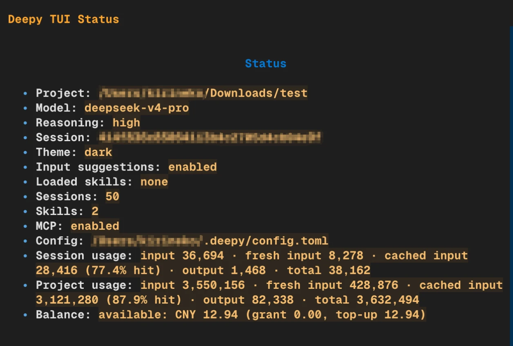
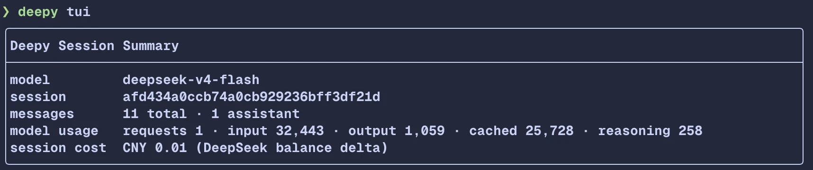

# Deepy UI And Deepy TUI

This page explains Deepy's two terminal interfaces and records the current
feature alignment status.

## Interface Positioning

- **Deepy UI**: the stable default interface, started with `deepy`.
- **Deepy TUI**: the experimental Textual interface, started with `deepy tui`.
- Both interfaces share the same model runner, tools, sessions, skills, MCP,
  background tasks, and automatic compacting logic.
- TUI is not the default entrypoint by design.

## Screenshots

Deepy TUI keeps the transcript, prompt, status line, and shortcut hints visible
inside one Textual interface.

`/status` shows usage, context-window pressure, and DeepSeek balance on demand.

Exiting the TUI prints the same compact session summary as the stable UI.

## Deepy UI

Deepy UI is the stable interface built with Rich and prompt-toolkit.

Main capabilities:

- Normal chat and multi-turn agent execution.
- Thinking, tool call, tool result, usage, and error rendering.
- Tool output for `shell`, `read`, `modify`, `todo_write`,
  `AskUserQuestion`, Web, MCP, and background task tools.
- Session/context commands such as `/new`, `/resume`, `/sessions`, and
  `/compact`.
- Management commands such as `/init`, `/reset`, `/model`, `/theme`, `/mcp`,
  `/status`, and `/skills`.
- `/ps` for model-started background shell tasks and `/stop` for stopping one
  task or all running tasks.
- `/status` for usage, context window, and DeepSeek balance. The balance API is
  called only when `/status` is explicitly invoked.
- Unified session summary after `/exit`, `/quit`, or pressing Ctrl+D twice.
- Exit cleanup for running background tasks before MCP runtime cleanup.
- `!command` local command mode.
- Slash-command completion and `@file` completion.
- Prompt history.
- Automatic compacting and `compact next` status.
- Bottom status with model, cwd, AGENTS, MCP count, and context usage.
- First-run setup when API key/model/theme configuration is missing.

## Deepy TUI

Deepy TUI is the experimental interface built with Textual.

Main capabilities:

- Normal chat and multi-turn agent execution.
- Thinking, tool call, tool result, usage, and error rendering.
- Expandable and collapsible tool result blocks with metadata and clearer
  visual grouping.
- Dedicated display for `shell`, `read`, `todo_write`, Web, MCP, `load_skill`,
  and background task tools.
- AskUserQuestion single-choice, multiple-choice, custom answer, cancel, and
  same-session continuation flows.
- `/new`, `/resume`, `/sessions`, and `/compact`.
- `/init`, `/reset`, `/model`, `/theme`, `/mcp`, `/status`, and `/skills`.
- `/ps` and `/stop` for background shell tasks.
- `/status` with usage, context window, and DeepSeek balance. The balance API is
  called only when `/status` is explicitly invoked.
- Session summary after `/exit`, `/quit`, or pressing Ctrl+D twice.
- `!command` local command mode, rendered with the shell tool block.
- Slash-command completion and `@file` completion.
- Prompt history.
- Automatic compacting.
- Bottom status with model, cwd, AGENTS, MCP count, context usage, and
  `compact next`.
- Dedicated `/skills` management UI with market/installed tabs, viewing,
  installation, uninstallation, updating, and refresh.
- Built-in skills are not shown in the TUI skill management UI.
- User/project skill deletion for manually installed skills.
- In-TUI first-run setup when configuration is missing.

## Feature Comparison

| Feature | Deepy UI | Deepy TUI | Current status |
| --- | --- | --- | --- |
| Default entrypoint | Yes | No | By design |
| Normal chat | Supported | Supported | Aligned |
| Thinking display | Supported | Supported | Aligned |
| Tool call display | Supported | Supported | Aligned |
| AskUserQuestion | Supported | Supported | Aligned |
| Session resume | Supported | Supported | Aligned |
| `/compact` | Supported | Supported | Aligned |
| Automatic compact | Supported | Supported | Aligned |
| `compact next` status | Supported | Supported | Aligned |
| `/init` | Supported | Supported | Aligned |
| `/reset` | Supported | Supported | Same capability, different interaction form |
| `/model` | Supported | Supported | Aligned |
| `/theme` | Supported | Supported | Aligned |
| `/mcp` | Supported | Supported | Aligned |
| `/status` | Supported | Supported | Aligned; balance is queried only on explicit call |
| `/ps` / `/stop` | Supported | Supported | Aligned; manages background shell tasks |
| `/skills` market | Supported | Supported | Aligned |
| Exit summary | Supported | Supported | Aligned for `/exit`, `/quit`, and Ctrl+D |
| Exit background task cleanup | Supported | Supported | Aligned |
| Delete user/project skill | Supported | Supported | Aligned |
| Built-in skill management display | Hidden | Hidden | Aligned |
| `!command` | Supported | Supported | Aligned |
| Slash-command completion | Supported | Supported | Aligned |
| `@file` completion | Supported | Supported | Aligned |
| Prompt history | Supported | Supported | Aligned |
| Bottom status | Supported | Supported | Aligned |
| Newline shortcut | `Ctrl+J` | `Ctrl+J` | Aligned |
| Diff display | Single column | Single column | Current choice |

## Known Gaps Or Pending Checks

- Windows PowerShell 7: continue validating `!command`, file encoding, newline
  behavior, and tool output after releases.
- TUI remains experimental and is not the default `deepy` interface.

There are no known core daily-feature gaps at this time.

## Future Improvements

- Continue splitting TUI app/widgets code to reduce maintenance cost.
- Improve narrow-screen, wide-screen, sidebar, long-output, and long-prompt
  layout behavior.
- Evaluate whether wide or side-by-side diff views are needed; the current
  single-column diff is acceptable.
- Continue polishing the TUI skills market visual details.
- Improve bottom-status truncation and priority strategy on narrow screens.
- Add a stronger cross-platform conclusion after Windows validation is complete.
