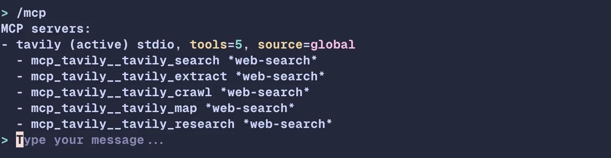
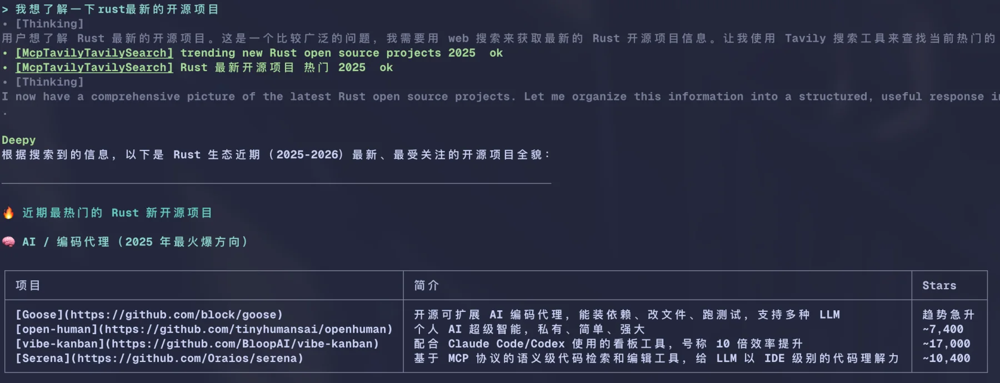

# Deepy MCP 配置

Deepy 通过 OpenAI Agents SDK 支持 MCP server。Deepy 不自己实现 MCP 协议 client，
而是把你的配置映射为 SDK MCP server，并把已连接的 server 交给 agent。

当你希望 Deepy 调用外部工具时，可以使用 MCP，例如搜索、数据库、本地服务或组织内部上下文服务。

Deepy 使用两个文件：

- `~/.deepy/config.toml`：Deepy 自身的 MCP 策略和偏好。
- `~/.deepy/mcp.json`：MCP server 定义，使用常见的 `mcpServers` 结构。

项目级 MCP 配置默认忽略。显式开启后，Deepy 也会加载
`<project>/.deepy/mcp.json`。

## 最小 Tavily 配置

在 shell 中设置 API key：

```bash
export TAVILY_API_KEY="tvly-your-key"
```

创建 `~/.deepy/mcp.json`：

```json
{
  "mcpServers": {
    "tavily": {
      "transport": "stdio",
      "command": "npx",
      "args": ["-y", "tavily-mcp@latest"],
      "env": {
        "TAVILY_API_KEY": "${TAVILY_API_KEY}"
      },
      "roles": ["web_search"]
    }
  }
}
```

启动 Deepy 后运行：

```text
/mcp
```

应该能看到 `tavily` server 以及暴露给模型的 MCP tools。



当 server 标记了 `roles: ["web_search"]` 时，Deepy 可以优先使用这个 MCP 工具进行当前信息搜索，
同时保留内置 WebSearch 作为 fallback。



## `~/.deepy/config.toml`

所有 MCP 策略字段都是可选的。Deepy 有内存默认值，所以大多数用户只需要配置
`~/.deepy/mcp.json`。

```toml
[audit]
mode = "yolo"
mcp_safe_tools = [
  { server = "tavily", tool = "tavily_search" },
]

[mcp]
enabled = true
connect_timeout_seconds = 10
cleanup_timeout_seconds = 10
client_session_timeout_seconds = 30
cache_tools_list = true
allow_project_config = false
prefer_mcp_web_search = true

[mcp.web_search]
prefer_mcp = true
preferred_server = ""
preferred_tools = []
fallback_to_builtin = true
```

### `[audit]` MCP 审批字段

Audit mode 控制 MCP tool call 在执行前是否需要审批：

| 模式 | MCP 行为 |
| --- | --- |
| `normal` | 所有 MCP tool call 都需要审批。 |
| `auto` | MCP tool call 默认需要审批，除非精确的 `server` / `tool` 组合列在 `audit.mcp_safe_tools` 中。 |
| `yolo` | MCP tool call 不弹审批提示，直接执行。 |

`mcp_safe_tools` 使用 MCP server key 和原始 MCP tool name，不使用 SDK
加前缀后的模型可见名称。这个列表应保持很窄；MCP tool 可能代表 issue 创建、
数据库写入或本地服务修改等外部副作用。

### `[mcp]` 字段

| 字段 | 类型 | 默认值 | 含义 |
| --- | --- | --- | --- |
| `enabled` | boolean | `true` | 是否启用 MCP。设为 `false` 会禁用所有 MCP server。 |
| `connect_timeout_seconds` | number | `10` | 每个 MCP server 的连接超时时间。 |
| `cleanup_timeout_seconds` | number | `10` | 退出时关闭 MCP server 的超时时间。 |
| `client_session_timeout_seconds` | number | `30` | SDK MCP session 读超时。较慢的 `tools/list` 或 `tools/call` 超时时可以调大它。 |
| `cache_tools_list` | boolean | `true` | 允许 SDK 缓存 MCP tool 列表，降低每轮延迟。 |
| `allow_project_config` | boolean | `false` | 是否允许加载 `<project>/.deepy/mcp.json`。除非信任项目，否则保持关闭。 |
| `prefer_mcp_web_search` | boolean | `true` | 是否启用 MCP 搜索工具优先的提示词引导。 |

### `[mcp.web_search]` 字段

| 字段 | 类型 | 默认值 | 含义 |
| --- | --- | --- | --- |
| `prefer_mcp` | boolean | `true` | 检测到 MCP web-search tool 时，优先于内置 `WebSearch`。 |
| `preferred_server` | string | 空 | 可选的优先 MCP server 名，必须匹配 `mcpServers` 里的 key。 |
| `preferred_tools` | string array | `[]` | 可选的优先 MCP 搜索工具名列表。 |
| `fallback_to_builtin` | boolean | `true` | MCP 搜索不可用或失败时，保留内置 `WebSearch` fallback。 |

优先级顺序：

1. `preferred_server` / `preferred_tools`
2. `mcp.json` 中的 `roles = ["web_search"]`
3. 名称启发式：server/tool/description 中包含 `tavily`、`search`、
   `web_search` 或 `web-search`

## `~/.deepy/mcp.json`

顶层结构：

```json
{
  "mcpServers": {
    "server-name": {
      "transport": "stdio"
    }
  }
}
```

`server-name` 会成为模型可见工具名的一部分。例如名为 `tavily` 的 server 暴露
`tavily_search` 工具时，模型看到的是：

```text
mcp_tavily__tavily_search
```

Server 名称可以包含字母、数字、`.`、`_` 和 `-`。

### 通用 server 字段

| 字段 | 类型 | 默认值 | 含义 |
| --- | --- | --- | --- |
| `enabled` | boolean | `true` | 保留配置但跳过该 server 时设为 `false`。 |
| `transport` | string | 自动推断 | `stdio` 或 `streamable_http`。如果省略且存在 `command`，Deepy 使用 `stdio`；否则使用 `streamable_http`。 |
| `roles` | string array | `[]` | Deepy 本地元数据。用 `["web_search"]` 标记优先搜索 server。 |
| `preferred_tools` | string array | `[]` | Deepy 本地元数据，标记该 server 上优先使用的 tool 名。 |

Deepy 会忽略未知字段，除非这些字段让 server 定义变得歧义或无效。

### Stdio server 字段

```json
{
  "mcpServers": {
    "filesystem": {
      "transport": "stdio",
      "command": "npx",
      "args": ["-y", "@modelcontextprotocol/server-filesystem", "/path/to/project"],
      "cwd": "/path/to/project",
      "env": {
        "TOKEN": "${TOKEN}"
      }
    }
  }
}
```

| 字段 | 类型 | 必填 | 含义 |
| --- | --- | --- | --- |
| `command` | string | 是 | 启动 MCP server 的命令。 |
| `args` | string array | 否 | 传给 `command` 的参数。 |
| `cwd` | string | 否 | MCP server 进程的工作目录。 |
| `env` | object | 否 | 传给 server 进程的环境变量。 |

Stdio MCP server 会启动本地命令，请把它当成可信代码处理。

### Streamable HTTP server 字段

```json
{
  "mcpServers": {
    "remote-search": {
      "transport": "streamable_http",
      "url": "https://mcp.example.com/mcp",
      "headers": {
        "Authorization": "Bearer ${MCP_TOKEN}"
      },
      "roles": ["web_search"]
    }
  }
}
```

| 字段 | 类型 | 必填 | 含义 |
| --- | --- | --- | --- |
| `url` | string | 是 | Streamable HTTP MCP endpoint。 |
| `headers` | object | 否 | 发送给 MCP server 的 HTTP headers。 |

`transport = "http"` 会被当成 `streamable_http` 的别名。

## 环境变量占位符

`env` 和 `headers` 的值可以引用 shell 环境变量：

```json
{
  "TAVILY_API_KEY": "${TAVILY_API_KEY}"
}
```

如果环境变量不存在，Deepy 会跳过该 server，并在 `/mcp` 中显示校验错误。

Deepy 不会在 `/mcp`、status 输出或普通配置展示里打印 `env` / `headers` 的明文值。

## 项目级配置

项目级 MCP 配置路径：

```text
<project>/.deepy/mcp.json
```

默认忽略。要全局开启：

```toml
[mcp]
allow_project_config = true
```

只对你信任的仓库开启项目级 MCP 配置。项目级 stdio server 可以启动本地命令。

## Subagent 搜索继承

内置 `explore` subagent 默认只会继承 Deepy 识别为 web/search 类的 MCP tools。
Deepy 会保留稳定的 server 前缀工具名，例如 `mcp_tavily__tavily_search`，
并且默认不会把非搜索 MCP tools 传给 subagent。

自定义 subagent 可以关闭搜索继承：

```md
---
name: docs-research
description: Search docs and summarize references.
mcp:
  inherit_search: false
---

Read-only research instructions.
```

这个继承过程不会在状态输出里暴露 MCP secret。

## 排查问题

在 Deepy 里使用 `/mcp` 查看 server 状态、tool 名和校验错误。

如果是 Tavily 本地 stdio 配置，先检查：

```bash
node --version
npx --version
npx -y tavily-mcp@latest
```

如果找不到 `npx`，安装 Node.js，或者在 `command` 里写 `npx` 的完整路径。

如果某个 server 被跳过，检查：

- `${NAME}` 占位符引用的环境变量是否缺失。
- `transport` 是否无效，或者是否缺少 `command` / `url`。
- 项目级 MCP 配置是否仍被 `allow_project_config = false` 禁用。
- stdio 命令能否在同一个 shell 中直接运行。
